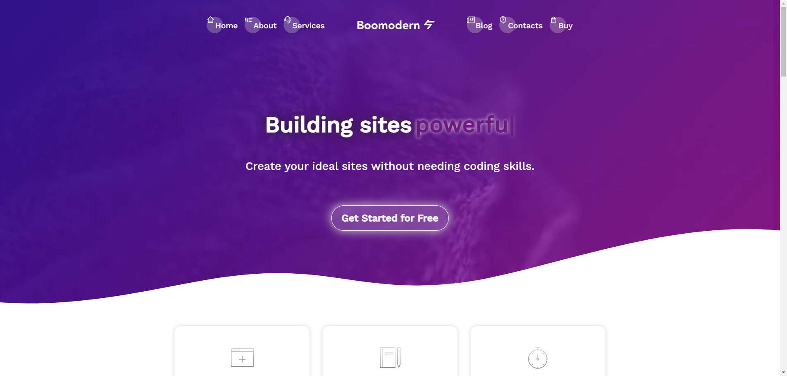
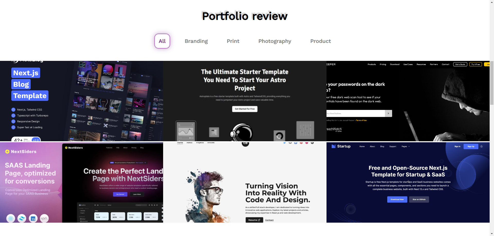
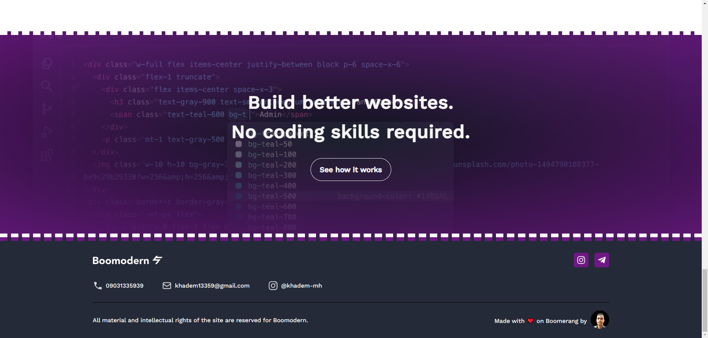

# 
Hi 👋 I'm an expert on React Js 👨‍💻 Next JS

__*`Note: Any copying of this file and publishing it with a different appearance and putting it as a sample of your work will be prosecuted`*__

>### Languages
>> 
>> 
>> 
>> 
>> 
>>
>> 

>### Packages
>> 
>> 
>> 

## View of the project

check this [URL](https://khadem-mh.github.io/music-player/) for visit this page

___
>### Social Network
> 
> 
> 
> 
> 
> 
> 
